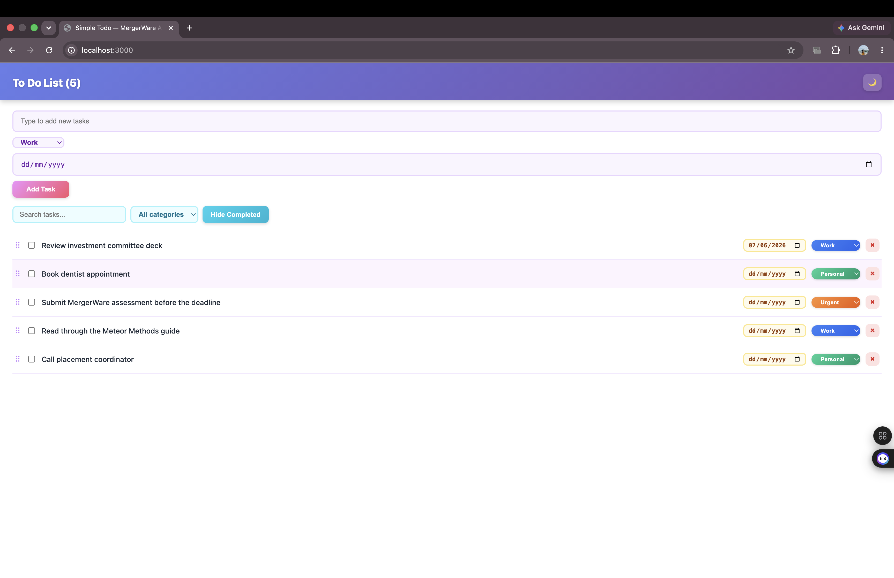

# Task Management Dashboard

A task management application built using **Meteor.js**, **Blaze**, and **MongoDB** as part of the MergerWare Software Engineering Internship Assessment.

The application allows users to create, organize, track, and manage tasks through task categorization, drag-and-drop reordering, due date tracking, search functionality, task editing, and a clean user-friendly interface.

---

## Application Preview


---

## Features

### Task Management

- Create Tasks
- Edit Existing Tasks
- Delete Tasks
- Mark Tasks as Completed
- Hide Completed Tasks

### Task Categorization

Tasks can be organized into predefined categories:

- Work
- Personal
- Urgent

Users can also filter tasks by category.

### Drag-and-Drop Reordering

Tasks can be reordered using drag-and-drop functionality powered by SortableJS.

The task order is stored in MongoDB to maintain consistency after page refreshes.

### Search Functionality

Users can instantly search for tasks using the integrated search bar.

### Due Date Tracking

Tasks support due dates, helping users manage deadlines effectively.

### Dark Mode

A built-in dark mode toggle improves user experience and accessibility.

### User Interface Enhancements

- Responsive layout
- Color-coded categories
- Interactive task controls
- Clean dashboard design

---

## Technology Stack

| Technology | Purpose |
|------------|----------|
| Meteor 3.4.1 | Full-stack framework |
| Blaze | Frontend templating |
| MongoDB | Database |
| JavaScript (ES6+) | Application Logic |
| HTML5 | Structure |
| CSS3 | Styling |
| SortableJS | Drag-and-Drop Functionality |

---

## Project Structure

```text
client/
├── main.css
├── main.html
└── main.js

imports/
├── api/
│   ├── tasksMethods.js
│   └── tasksPublications.js
│
├── db/
│   └── TasksCollection.js
│
└── ui/
    ├── App.html
    ├── App.js
    ├── Task.html
    └── Task.js

server/
└── main.js
```

## Getting Started

### Install Dependencies

```bash
meteor npm install
```

### Run the Application

```bash
meteor run
```

### Open in Browser

```text
http://localhost:3000
```

---

## Assessment Requirements Covered

- Task Categories
- Category Filtering
- Drag-and-Drop Reordering
- MongoDB Integration
- Meteor Methods
- Publications & Subscriptions

---

## Author

**Thanusha N**

Developed for the MergerWare Software Engineering Internship Technical Assessment.